# New Creation Soda App — Admin & Content Guide

This is the reference doc for running the New Creation Soda Works app day to day: adding new admin/rep users, and adding or editing product/video/asset content. Written for whoever's managing the site, technical or not.

**Live site:** https://nc-soda.vercel.app
**Studio (content editor):** https://nc-soda.vercel.app/studio
**Partner sign-in:** https://nc-soda.vercel.app/login

---

## How the app is put together (read this once)

Three systems work together behind the one live site:

- **Supabase** — accounts, sign-in, and *gated* product specs (SKU, UPC, case pack, net weight, ABV, ingredients, shelf life). Also the login database for reps/admins.
- **Sanity Studio** (`/studio`) — everything editorial: product name/tagline/description/photo, video titles and descriptions, sell sheet titles/descriptions. This is where day-to-day content edits happen.
- **Mux** — hosts the rep-only training videos, streamed through a signed (locked) link so they can't be watched by the public.

**The one thing to remember:** a product's *content* (Sanity) and its *gated specs* (Supabase) are joined by matching **slug**. If you add a brand-new product, you need a matching entry in both places — see [Adding a brand-new product](#adding-a-brand-new-product) below.

---

## 1. Adding a new Admin user

1. Go to the [Supabase dashboard](https://supabase.com/dashboard) → your project → **Authentication** → **Users** → **Add user** → **Create new user**.
2. Enter their email and a temporary password. Click **Create user**.

   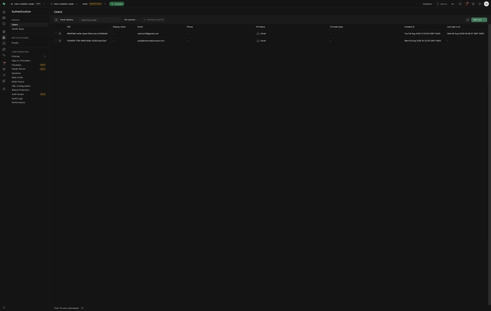

3. Everyone is created as a `rep` by default. To promote them to admin: **SQL Editor** → **+ New query** → run (with their real email):

   ```sql
   update public.profiles set role = 'admin' where email = 'newadmin@example.com';
   ```

   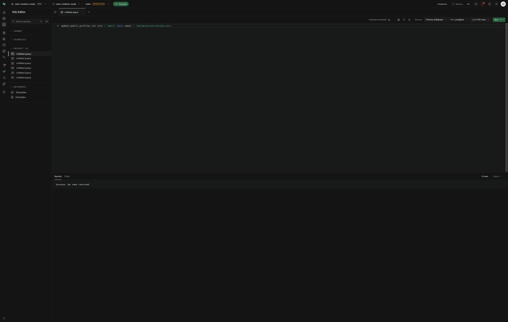

4. Send them the sign-in link (`/login`) and their temporary password. They should be able to change their password themselves once signed in via Supabase's account flow (or you can reset it the same way — see Troubleshooting below).

---

## 2. Adding a new Rep user

Same as above, but skip the promote step — reps stay at the default role.

1. Supabase dashboard → **Authentication** → **Users** → **Add user** → **Create new user**.
2. Enter their email + a temporary password.

   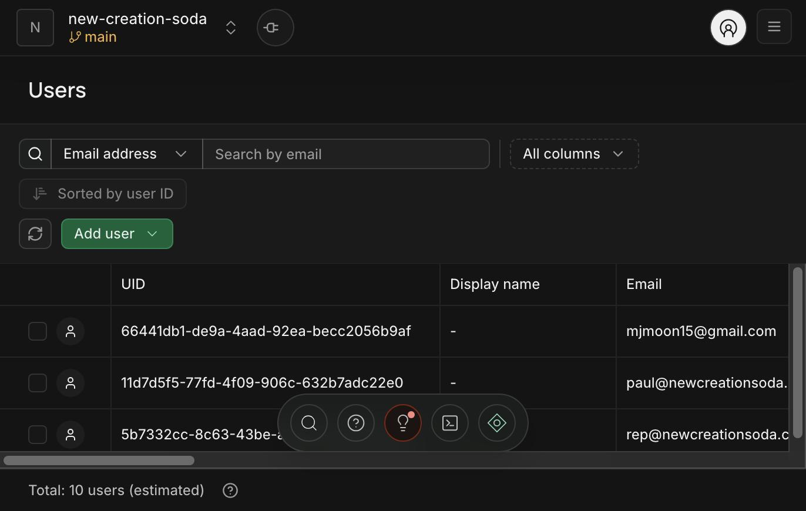

3. Confirm the row landed in `public.profiles` with `role = rep` (this happens automatically, no extra step needed):

   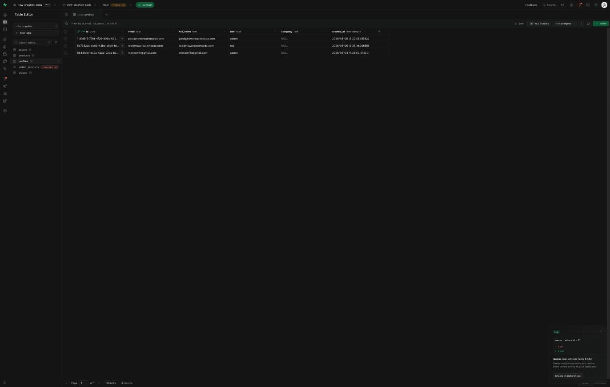

4. Send them the sign-in link (`/login`) and password. They'll land on `/rep` after signing in — full product specs, sell sheets/POS, and training videos, no admin management screens.

   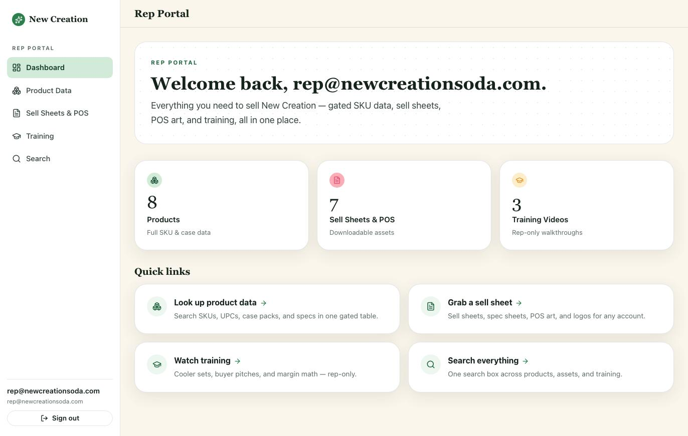

---

## 3. Editing existing content in Studio

Go to **https://nc-soda.vercel.app/studio** and sign in (uses the same Sanity account you set up during launch — invite teammates via [sanity.io/manage](https://sanity.io/manage) → your project → Members, if they need Studio access too).

You'll see three content types in the left sidebar: **Product**, **Video**, **Sell Sheet / Asset**.

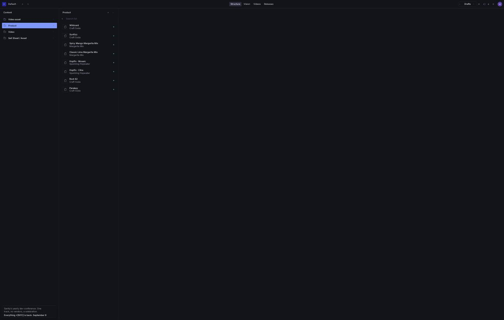

The Sell Sheet / Asset list looks the same way — one row per real file, no test entries:

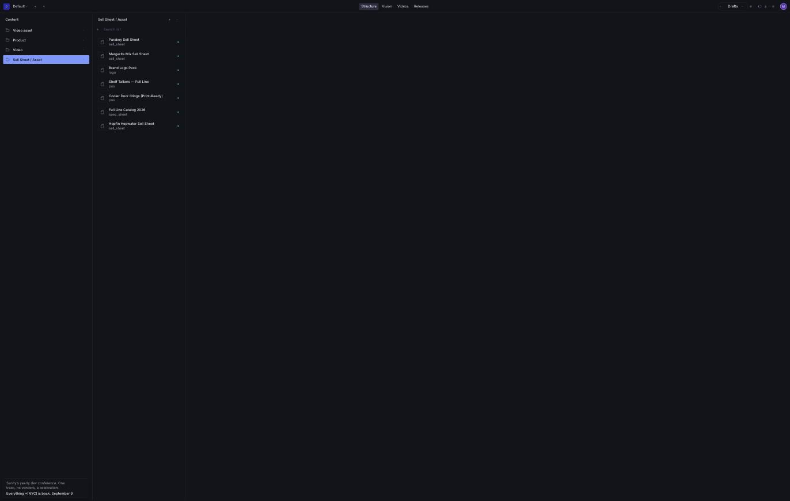

### Editing a product's content

Open any Product doc. You can freely edit:

- Name, tagline, description
- Category (Craft Soda / Sparkling Hopwater / Margarita Mix)
- Accent color (hex, used to theme the product card)
- Product image
- Calories, gluten-free flag, featured flag

📸 *[Screenshot: Product edit form]*

**Do not change the Slug** on an existing product unless you also update the matching `slug` in the Supabase `products` table — this is the link between the public content and the gated specs (SKU/UPC/case data). Changing one without the other breaks the join and the rep-only spec table will show blanks for that product.

### Editing gated specs (SKU, UPC, case pack, etc.)

These live in Supabase, not Studio. **Table Editor** → `products` table → find the row by slug → edit directly.

📸 *[Screenshot: Supabase Table Editor, products table]*

---

## 4. Adding a brand-new product

Two steps, in either order, joined by an identical slug:

**A. Content in Studio:**
1. `/studio` → **Product** → **+ Create**.
2. Fill in name, slug, tagline, description, category, color, image, calories, gluten-free, featured.
3. **Publish**.

   📸 *[Screenshot: new Product doc before publish]*

**B. Specs in Supabase:**
1. Supabase → **Table Editor** → `products` → **Insert row**.
2. Fill in the **same slug** as the Studio doc, plus `sku`, `upc`, `case_upc`, `case_pack`, `unit_volume`, `net_weight`, `abv` (optional), `ingredients`, `shelf_life_days`.
3. Save.

   📸 *[Screenshot: Supabase Insert row form for products]*

4. Refresh the public catalog and `/rep/products` — the new product should appear in both, with specs showing correctly on the rep side.

---

## 5. Adding a public video (brand or product spot)

1. `/studio` → **Video** → **+ Create**.
2. Title, description, category (`brand` or `product`), **Access = public**.
3. Paste the **YouTube ID** (the part after `v=` in a YouTube URL).
4. Add a thumbnail and duration (seconds).
5. **Publish**.

   📸 *[Screenshot: public Video doc filled in]*

---

## 6. Adding a rep-only training video (Mux)

1. `/studio` → **Video** → **+ Create** (or edit an existing one).
2. Title, description, category = `training`, **Access = rep**.
3. A **Training video file** upload field will appear. Drag your video file in.
4. First time only: it'll ask you to **Configure API** — enter the Mux Token ID and Secret (found in the Mux dashboard → Settings → API Access Tokens, or ask whoever set up the project).
5. In the upload dialog: under **Advanced Playback Policies**, uncheck **Public** and check **Signed**. Leave DRM disabled.

   📸 *[Screenshot: Mux upload dialog with Signed checked]*

6. Click **Upload**, wait for status to reach **ready** (larger files take longer), then **Publish**.
7. Check `/rep/training` — the video should now play for signed-in reps/admins.

---

## 7. Adding a downloadable sell sheet / POS asset / logo pack

Two parts: the file itself (Supabase Storage) and its listing (Sanity).

**A. Upload the file:**
1. Supabase dashboard → **Storage** → **assets** bucket.
2. Upload the file **directly to the bucket root** — don't create subfolders, it just adds path confusion later.
3. Click the uploaded file → note its exact filename (case-sensitive). Rename it here if the original filename has spaces or special characters — those can cause problems later, so something like `stuckeys-pecan-root-beer.pdf` is safer than `Stuckey's Pecan Root Beer (final v2).pdf`.

   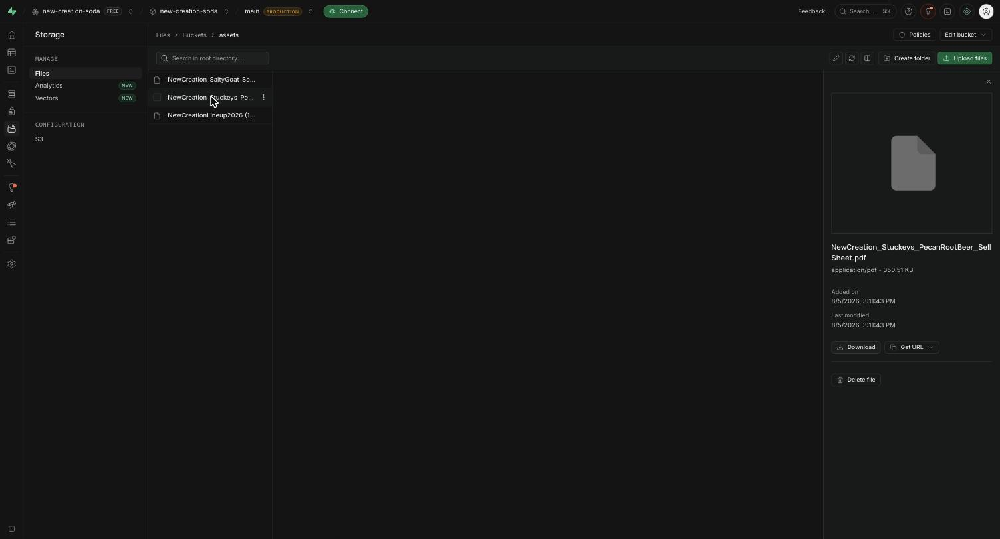

**B. Create the listing:**
1. `/studio` → **Sell Sheet / Asset** → **+ Create**.
2. Title, description, type (`sell_sheet` / `pos` / `spec_sheet` / `logo`).
3. **Supabase Storage path** = the exact filename from step A (e.g. `parakey-sell-sheet.pdf`).
4. File type (PDF/PNG/ZIP), file size in bytes, and optionally link it to a product.
5. **Publish**.

   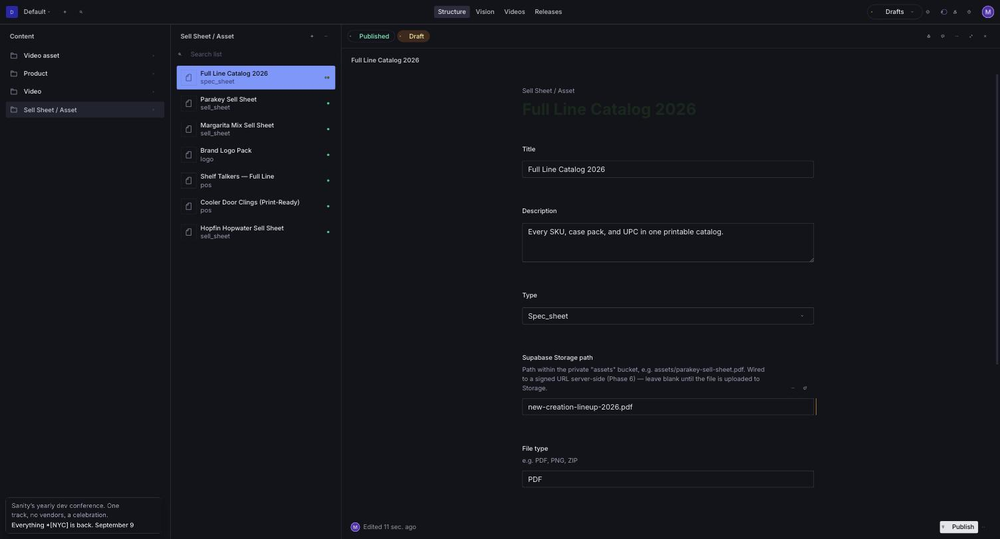

   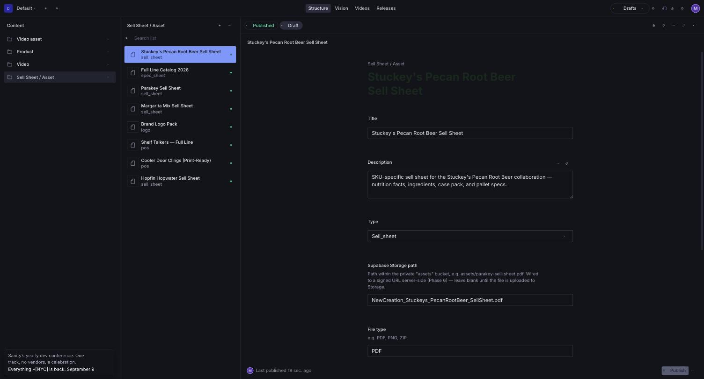

6. Check `/rep/sell-sheets` — the download button should now pull the real file via a secure, time-limited link.

   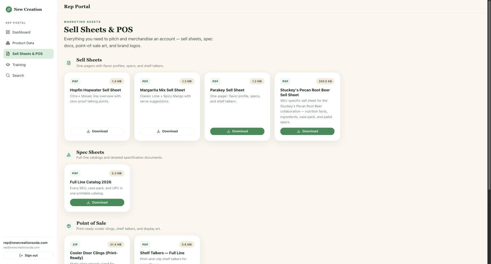

---

## 8. Sending a sell sheet or asset directly to a buyer

Reps can email any sell sheet, spec sheet, POS asset, or logo pack straight to a buyer from `/rep/sell-sheets` — no download-and-forward needed. This runs on [Resend](https://resend.com).

### One-time setup (admin)

1. Sign up at [resend.com](https://resend.com) — the free plan covers this (3,000 emails/month, 100/day), more than enough for reps emailing sell sheets.
2. **Domains** → **Add Domain** → add a domain or subdomain you control (e.g. `mail.newcreationsoda.com`) and add the DNS records Resend gives you. Emails can't send to arbitrary buyers until this domain shows **Verified** — the default sandbox address only sends to your own account email.
3. **API Keys** → **Create API Key** → copy it.
4. In Vercel: **Settings** → **Environment Variables**, add:
   - `RESEND_API_KEY` = the key from step 3
   - `RESEND_FROM_EMAIL` = an address at your verified domain, e.g. `reps@mail.newcreationsoda.com`
5. Redeploy (see the Quick reference below) so the new environment variables take effect.

Until these are set, the "Send to buyer" button will return a "not connected yet" error instead of sending — the Download button still works normally.

### Using it (rep)

1. `/rep/sell-sheets` → find the asset → **Send to buyer**.
2. Enter the buyer's email (required), their name (optional), and a short note (optional).
3. **Send.** The buyer gets an email with the note, the file's title/description, and a download button linking to a signed URL good for 7 days. Replies go straight to the rep's own inbox — the buyer never sees an internal address.

📸 *[Screenshot: Send to buyer form + confirmation]*

---

## 9. Clearing out placeholder/seed content

To delete any Studio document: open it → click the **⋯** (three-dot) menu next to **Publish**, bottom-right → **Delete**.

If the document has never been published (still says "Draft" only, no **Published** tab), **Delete** can hang on "Looking for referring documents..." — Sanity is checking the whole dataset for anything pointing at it, and that check can spin for a while. For an unpublished draft, use **Discard changes** instead: it deletes the same draft document immediately with a simple "Are you sure?" confirmation, no referring-documents check needed.

If you're retiring an entire seed product (not just editing it), also delete its matching row in the Supabase `products` table so stale gated specs don't linger.

---

## Quick reference

| What | Where |
|---|---|
| Live site | https://nc-soda.vercel.app |
| Content editor | https://nc-soda.vercel.app/studio |
| Partner sign-in | https://nc-soda.vercel.app/login |
| Accounts, roles, gated specs | [Supabase dashboard](https://supabase.com/dashboard) |
| Editorial content, images, video listings | [Sanity manage](https://sanity.io/manage) |
| Training video hosting | [Mux dashboard](https://dashboard.mux.com) |
| Deployment / environment variables | [Vercel dashboard](https://vercel.com/dashboard) |

---

## Troubleshooting

**"Object not found" when downloading a sell sheet** — the Storage path in the Sanity doc doesn't exactly match where the file lives in the bucket. Click the file in Supabase Storage → **Get URL** to see its real path, and match that exactly (case-sensitive, no stray folder prefix).

**A user forgot their password** — easiest fix for internal accounts: Supabase → Authentication → Users → delete their account → recreate it with a new password (re-run the promote-to-admin SQL if they were an admin).

**New product's specs aren't showing on `/rep/products`** — the slug in Sanity and the slug in Supabase's `products` table don't match exactly. They must be identical, character for character.
